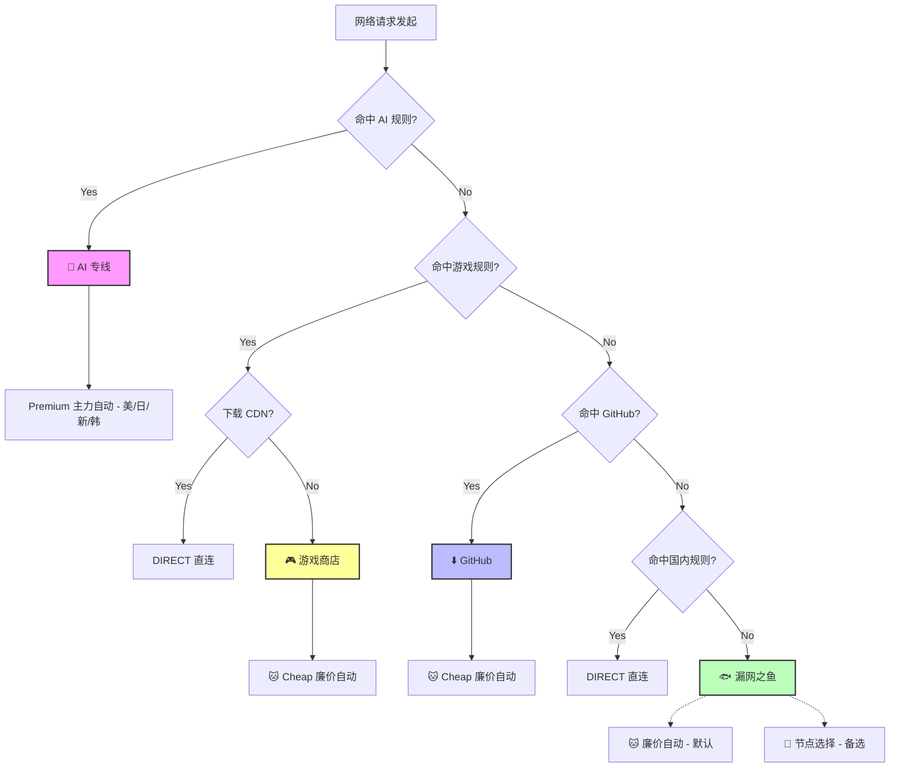

# Clash 分流配置：双订阅版 (Premium + Cheap)

> V3.1 - (PC / Mobile)

## 🧩 核心策略组 (Proxy Groups) 解析

### 1. 🤖 AI 专线 (Premium Lane)
* **覆盖范围**：Google AI (Gemini, DeepMind)、Anthropic (Claude)、Microsoft (Copilot, Bing)、Google 主站 (YouTube, Search)，其中主要是对Gemini系约束。

## 1.5 GPT 线路

### 2. 🎮 游戏商店 (Game Store Lane)
* **覆盖范围**：Steam 商店/社区、Epic Games Store。

### 3. ⬇️ GitHub (Code Lane)
* **功能**：GitHub 全站专用通道。
* **策略**：
    * **默认走廉价节点**：clone 和下载 Release 不消耗优质流量。
    * **可手动切换**：如果廉价节点速度不佳，可切至优质自动或手动选节点。

### 4. 🐟 漏网之鱼 (The Catch-All)
* **功能**：处理所有未命中上述规则的"杂项流量"（普通的网页浏览、冷门网站）。
* **策略**：
    * **默认省流**：默认指向 `🐱 廉价自动`，日常浏览网页不消耗优质节点流量。
    * **灵活接管**：如果遇到廉价节点打不开的冷门网站，它会自动听从 `🚀 节点选择` 的指挥。

### 5. 🚀 节点选择 (Manual Control)
* **功能**：手动总控，也是"漏网之鱼"的备用靠山。
* **策略**：
    * **最高优先级**：当你想手动指定某条线路时（比如为了看特定地区的 Netflix），在这里切换即可。

### 6. 🇨🇳 国内连接 (Direct Lane)
* **功能**：国内流量直连，不走代理。
* **策略**：基于 `GEOIP` 和 `GEOSITE` 的 CN 规则自动匹配。

---

## 🛠️ 流量流转逻辑图

---

## 📦 使用方法

1. 将 `All in one.js` 中的 `YOUR_SUBSCRIPTION_URL_HERE` 替换为你的**廉价/备用**订阅链接。
2. 在 Clash 客户端中，将此脚本添加为**预处理脚本**（Script），主力订阅作为基础配置导入。
3. 脚本会自动合并两个订阅，并按策略分流。
